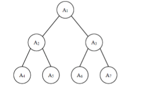

# 43729 - 完全二叉树的权值


## 题目

### 题目描述

给定一棵包含 $N$ 个节点的完全二叉树，树上每个节点都有一个权值，按从上到下、从左到右的顺序依次是 $A_1, A_2, ··· A_N$ ，如下图所示：



现在小明要把相同深度的节点的权值加在一起，他想知道哪个深度的节点权值之和最大？如果有多个深度的权值和同为最大，请你输出其中最小的深度。

注：根的深度是 1。

### 输入描述

第一行包含一个整数 $N \ (1  \leq  N  \leq  10^5)$ 。

第二行包含 $N$ 个整数 $A_1, A_2, ···, A_N \ (−10^5 \leq  A_i  \leq  10^5)$ 。

### 输出描述

输出一个整数代表答案。

### 输入输出样例

#### 示例

> 输入

```txt
7
1 6 5 4 3 2 1
```

> 输出

```txt
2
```

## 分析

略。
